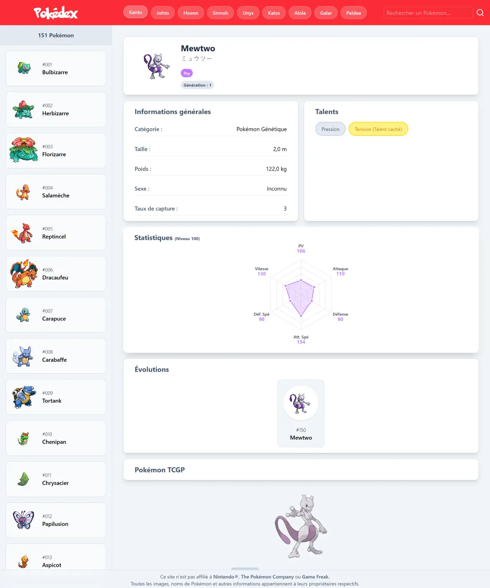
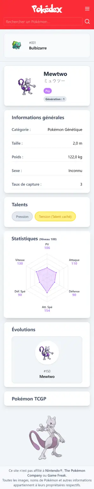

# Pokédex

## 🔖 Table of contents

<details>
    <summary>
        CLICK TO ENLARGE 😇
    </summary>
    📄 <a href="#description">Description</a>
    <br>
    🎓 <a href="#objectives">Objectives</a>
    <br>
    🔨 <a href="#tech-stack">Tech stack</a>
    <br>
    📂 <a href="#files-description">Files description</a>
    <br>
    💻 <a href="#installation_and_how_to_use">Installation and how to use</a>
    <br>
    🔧 <a href="#whats-next">What's next?</a>
    <br>
    ♥️ <a href="#thanks">Thanks</a>
    <br>
    👷 <a href="#authors">Authors</a>
</details>

## 📄 <span id="description">Description</span>

This project is a responsive Pokédex web application built using React. It serves as a training exercise to deepen my understanding of React and API integration. The app is in French and uses two public APIs: [Tyradex](https://tyradex.vercel.app/) for Pokémon data in French and [PokeAPI](https://pokeapi.co/) for high-resolution images.
<br>
I started entirely from scratch, coding all components myself without importing pre-made ones, in order to truly practice and strengthen my React skills.

Features include:

- Region selection to load Pokémon by generation.
- Pokémon listing per selected region.
- Clickable Pokémon to view detailed information.
- Search functionality for quick lookup.

## 🎓 <span id="objectives">Objectives</span>

- Gain practical experience with React and component architecture.
- Work with asynchronous JavaScript: fetch(), async/await.
- Manage French-language API data (Tyradex) alongside image retrieval (PokeAPI).
- Build a responsive, user-friendly interface with reusable components.
- Encourage clean, maintainable code practices and state handling.

## 🔨 <span id="tech-stack">Tech stack</span>

<p align="left">
    
    
    
    
    
    
    
    
    
</p>

## 📂 <span id="files-description">Files description</span>

| **FILES**           | **DESCRIPTION**                                   |
| :-----------------: | ------------------------------------------------- |
| `public`            | Public assets.                                    |
| `src`               | React source code (components, utilities...).     |
| `index.html`        | Application's HTML entry point.                   |
| `vite.config.js`    | Vite configuration for development and building.  |
| `package.json`      | Dependencies and scripts configuration.           |
| `package-lock.json` | Exact dependency version lockfile.                |
| `eslint.config.js`  | Linter configuration to enforce code quality.     |
| `.gitignore`        | Specifies files and folders to be ignored by Git. |
| `README.md`         | The README file you are currently reading 😉.    |

## 💻 <span id="installation_and_how_to_use">Installation and how to use</span>

**Installation:**

1. Clone this repository:
    - Open your preferred Terminal.
    - Navigate to the directory where you want to clone the repository.
    - Run the following command:

```bash
git clone https://github.com/fchavonet/web-pokedex.git
```

2. Open the repository you've just cloned.

3. Install dependencies:

```bash
npm install
```

4. Run the Jest test suite to ensure everything works correctly:

```bash
npm run test
```

5. Start the development server:

```bash
npm run dev
```

**How to use:**

1. Select a region (generation) from the navigation bar on the top.
2. Browse the displayed list of Pokémon from that region in the sidebar.
3. Use the search bar to filter Pokémon by name.
4. Click on a Pokémon card to display its detailed information and images on the right panel.
5. Enjoy a fully responsive UI on mobile and desktop.

You can also test the web application online by clicking [here](https://fchavonet.github.io/web-pokedex/). 

<table>
    <tr>
        <th align="center" style="text-align: center;">Desktop view</th>
        <th align="center" style="text-align: center;">Mobile view</th>
    </tr>
    <tr valign="top">
        <td align="center">
            
        </td>
        <td align="center">
            
        </td>
    </tr>
</table>

## 🔧 <span id="whats-next">What's next?</span>

- Integrate an additional API to display a new section with trading cards related to the selected Pokémon.
- Further split the application into smaller, reusable React components.
- Refactor and clean the codebase for better readability and maintainability.
- Enhance the user interface with a dark/light mode toggle for improved accessibility.
- Strengthen error handling by providing clear, user-friendly messages in case of network issues.

## ♥️ <span id="thanks">Thanks</span>

- Many thanks to the developers of [Tyradex](https://tyradex.vercel.app/) and [PokeAPI](https://pokeapi.co/) for making Pokémon data freely accessible in multiple formats.

## 👷 <span id="authors">Authors</span>

**Fabien CHAVONET**
- GitHub: [@fchavonet](https://github.com/fchavonet)
