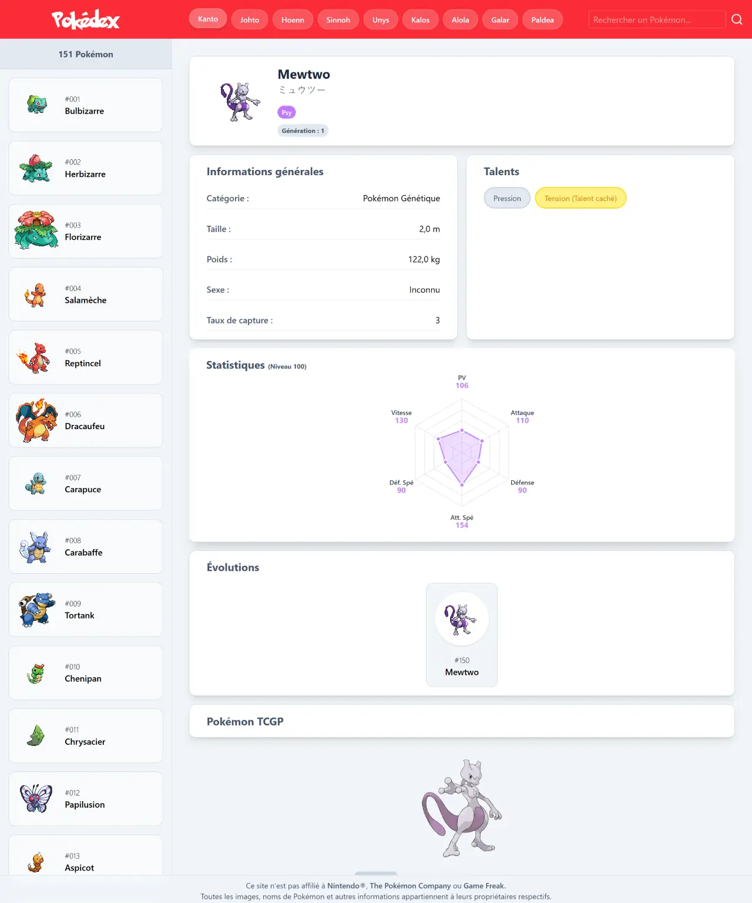

# Pokédex

## Description

This project is a responsive Pokédex web application built using React. It serves as a training exercise to strengthen my understanding of React and API integration. The app is in French and uses two public APIs: [Tyradex](https://tyradex.vercel.app/) for Pokémon data in French and [PokeAPI](https://pokeapi.co/) for high-resolution images.

I built everything from scratch without using pre-made components, to better practice and improve my React skills.

Features include:

- Region selection to load Pokémon by generation.
- Pokémon listing per selected region.
- Clickable Pokémon to view detailed information.
- Search functionality for quick lookup.

## Objectives

- Gain practical experience with React and component architecture.
- Work with asynchronous JavaScript: fetch(), async/await.
- Manage French-language API data (Tyradex) alongside image retrieval (PokeAPI).
- Build a responsive, user-friendly interface with reusable components.
- Encourage clean, maintainable code practices and state handling.

## Tech Stack


## File Description

| **FILE**            | **DESCRIPTION**                                                 |
| :-----------------: | --------------------------------------------------------------- |
| `public`            | Public assets.                                                  |
| `src`               | React source code (components, utilities...).                   |
| `index.html`        | HTML entry point of the application.                            |
| `vite.config.js`    | Vite configuration for development and building.                |
| `package.json`      | Dependencies and scripts configuration.                         |
| `package-lock.json` | Automatically generated file locking exact dependency versions. |
| `eslint.config.js`  | Linter configuration to enforce code quality.                   |
| `.gitignore`        | Specifies files and folders to be ignored by Git.               |
| `README.md`         | The README file you are currently reading 😉.                   |

## Installation & Usage

### Installation

1. Clone this repository:
    - Open your preferred Terminal.
    - Navigate to the directory where you want to clone the repository.
    - Run the following command:

```
git clone https://github.com/fchavonet/full_stack-pokedex.git
```

2. Open the cloned repository.

3. Install dependencies:

```
npm install
```

4. Run the Jest test suite to ensure everything works correctly:

```
npm run test
```

5. Start the development server:

```
npm run dev
```

### Usage

1. Select a region (generation) from the navigation bar at the top.
   
2. Browse the displayed list of Pokémon from that region in the sidebar.
   
3. Use the search bar to filter Pokémon by name.
   
4. Click on a Pokémon card to display its detailed information and images on the right panel.
   
5. Enjoy a fully responsive UI on mobile and desktop.

You can also test the project online by clicking [here](https://fchavonet.github.io/full_stack-pokedex/). 

<table>
    <tr>
        <th align="center" style="text-align: center;">Desktop view</th>
        <th align="center" style="text-align: center;">Mobile view</th>
    </tr>
    <tr valign="top">
        <td align="center">
            <picture>
                
            </picture>
        </td>
        <td align="center">
            <picture>
                
            </picture>
        </td>
    </tr>
</table>

## What's Next?

- Integrate an additional API to display a trading card section related to the selected Pokémon.
- Split the application into smaller, reusable React components.
- Refactor and clean the codebase for improved readability and maintainability.
- Add a dark/light mode toggle for better accessibility.
- Improve error handling with clear, user-friendly messages in case of network issues.

## Thanks

- Many thanks to the developers of [Tyradex](https://tyradex.vercel.app/) and [PokeAPI](https://pokeapi.co/) for making Pokémon data freely accessible in multiple formats.

## Author(s)

**Fabien CHAVONET**
- GitHub: [@fchavonet](https://github.com/fchavonet)
